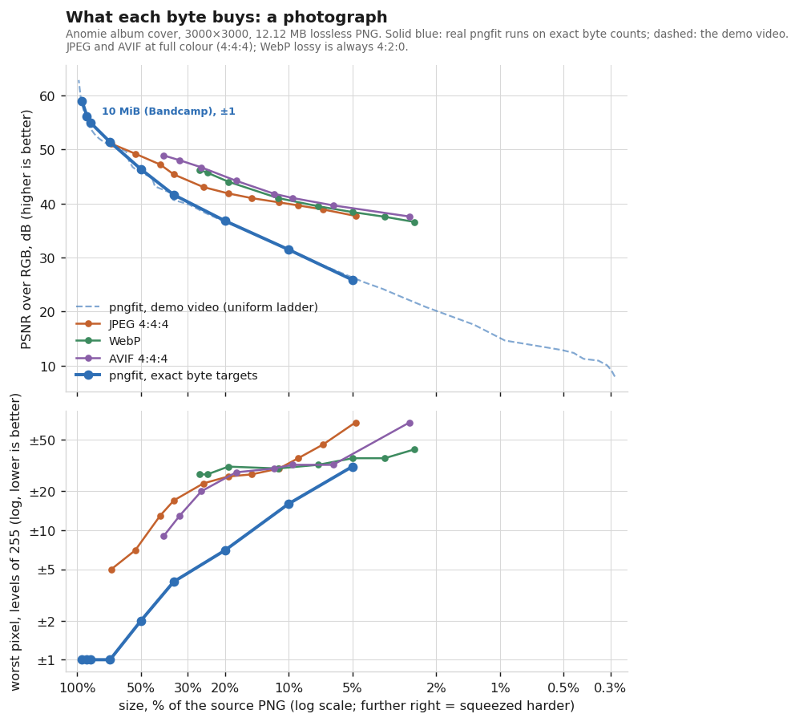
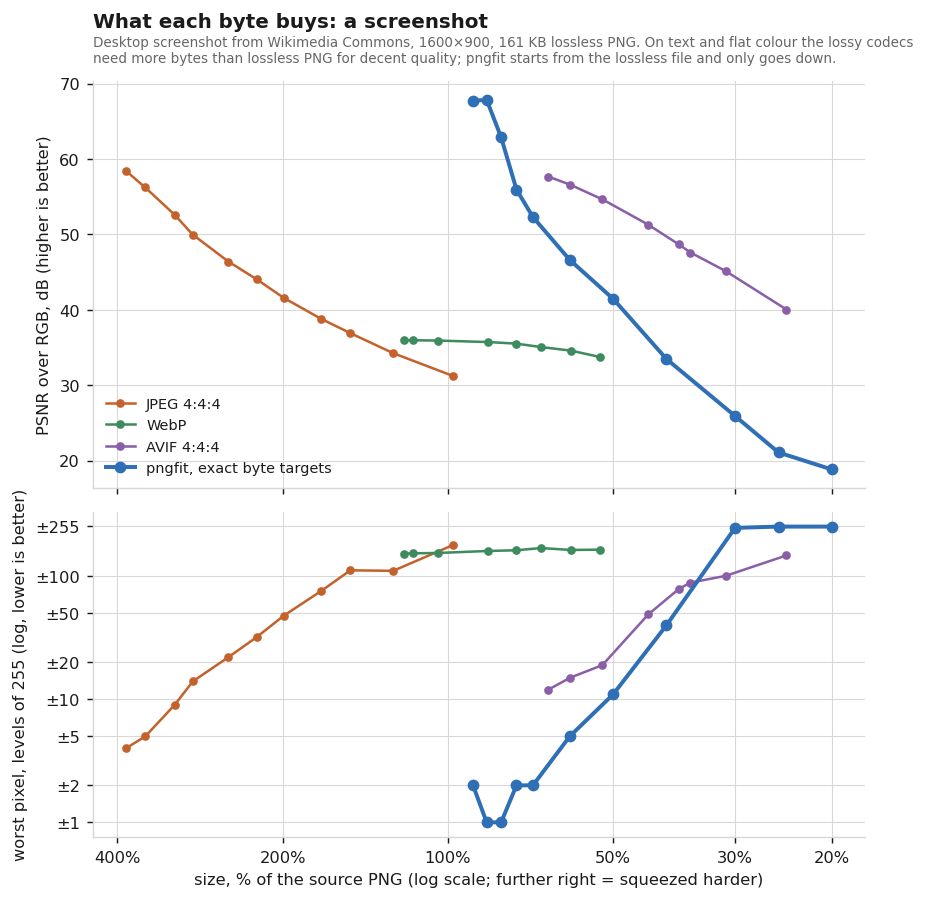
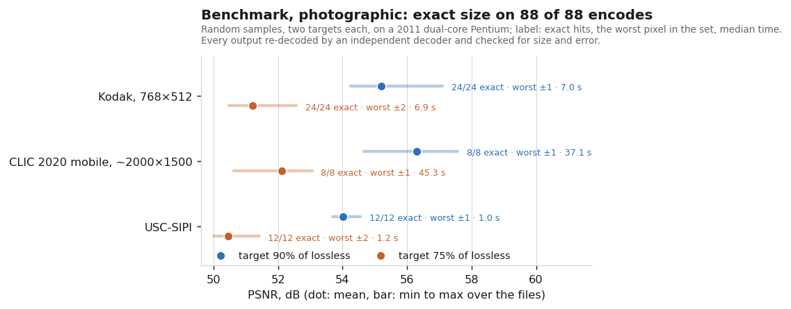
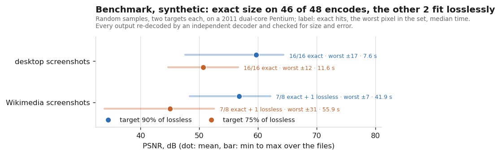

# pngfit

[](https://github.com/LicaRedMoth/pngfit/actions/workflows/check.yml)

**Make a truecolor PNG, or an animated one, exactly N bytes, with the least visible loss.**

Try it in the browser at **[pngfit.redmoth.moe](https://pngfit.redmoth.moe/)**: it runs on your own
machine and the image is never uploaded.

Upload forms have hard limits: Bandcamp takes a cover up to 10 MiB (10 485 760 bytes), and it
serves that file to listeners as uploaded. When a lossless PNG is 12 MB, the usual choices are a
palette (pngquant), a downscale, or JPEG. pngfit takes another route: it keeps the full resolution and
full truecolor, gives up the smallest possible amount of precision where the eye cannot see it,
and writes a valid PNG of **exactly** the size you ask for: not "about", not "under", the very byte.

```
$ pngfit cover.png cover_bandcamp.png -s 10MiB -e 1
metadata kept: iCCP[color] 358 B, pHYs[phys] 21 B, tEXt[exif] 2227 B, tEXt[iptc] 102 B, tEXt[xmp] 10330 B; dropped: nothing
content: photographic (0% flat pixels): 128-row strips, rough search at level 10
filter: Average, row switch 0.1
lossless (strips, level 12): 12217081 B, budget 10485760 B
…
slack after RD: 1888 B, landing on the exact byte
  coarse step in strip 16: -195 B left for the thin strips (2 probes)
  landed in strip 25 alone (96 probes)
wrote cover_bandcamp.png: 10485760 B (target 10485760, EXACT)
PSNR 54.90 dB, max error 1, pixels changed 30.3%
```

A 3000×3000 photo, a 12.12 MB lossless PNG, lands on 10 485 760 bytes in about four minutes on a
2011 dual-core laptop, with all its metadata. `-e 1` makes it a promise: no pixel moved by more
than 1 level out of 255. Any PNG decoder opens the result; nothing about it is non-standard.


https://github.com/user-attachments/assets/a7b442ad-b65d-4ba5-b3e1-76cce99d80d9




Near lossless, pngfit is the better tool. At Bandcamp's 10 MiB (86.5 % of the source) it moves
no pixel by more than ±1 at 54.9 dB; JPEG cannot even get there (quality 100 is 69 % of the size
and still moves a pixel by 5 levels), and WebP and AVIF never get below ±27 and ±9. Below about
65 % the picture flips for the average error: transform codecs suit photographs better than
prediction does, and at 20 % of the size JPEG and AVIF are 5–8 dB ahead. pngfit's worst pixel stays the
smallest at every size, though: ±7 at 20 %, where JPEG and AVIF are at ±26 and ±28.

## How it works

PNG predicts every byte from its neighbours (the *filter*) and DEFLATE compresses the
prediction residuals. pngfit rounds those residuals to multiples of a step *q*:

* the residual alphabet shrinks, so DEFLATE codes it in fewer bits;
* prediction always uses the already-rounded neighbours, exactly what a decoder sees, so the
  error never drifts: it stays at most ⌊q/2⌋ per sample;
* steps climb an odd ladder (1, 3, 5, …): q = 3 still means "±1 at most" but saves far more
  than q = 2;
* textured pixels (wood grain, noise, edges) are coarsened first, flat areas last
  (ranked by local 5×5 luma deviation);
* each row may switch PNG filter when another one is clearly cheaper after rounding;
* before any of that, a smaller format that holds the very same pixels is used, as oxipng does:
  an alpha channel that is opaque everywhere is dropped, grey stored as colour becomes grey,
  16-bit samples that are all 8-bit values become 8-bit (`--no-reduce` keeps the source format).

Landing on an exact byte count needs no model of DEFLATE. It comes from structure:

1. **Independent strips.** The image is cut into strips: 128 rows for photographs, 64 for
   screenshots and other flat images (told apart by the share of perfectly flat pixels; thinner
   strips let the budget follow text and UI elements, +1.2 dB on a desktop screenshot). Each is compressed by
   libdeflate on its own; the final-block bit of every fragment is cleared (found with zlib's
   `inflate(Z_BLOCK)`, the trick from zlib's `gzjoin.c`) and the fragment is byte-aligned with an
   empty stored block. Fragments concatenate into one valid zlib stream, so **file size is a plain
   sum of strip sizes**.
2. **Anchor rows.** The last row of every strip stays lossless, so the next strip predicts from
   original pixels and strips never depend on each other's settings.
3. **Rate–distortion allocation.** One integer per strip says how far its pixels climb the
   ladder. A Lagrangian search, refined over a few rounds and topped up greedily, spends the
   byte budget where it buys the most quality.
4. **Exact landing.** The few hundred bytes left over are spent by moving one strip pixel by
   pixel until the sum matches. Two thin 16-row strips at the bottom of the image do most of
   this: a probe on them costs an eighth of a full strip and moves the size in finer
   steps, and when they cannot take all of the slack, one full strip first takes the bulk. If a single strip skips the target (libdeflate re-splits blocks
   and sizes jump), a *pair* of strips is used: strip *i* takes `slack − x`, strip *j* takes `x`,
   and sums of two noisy size sets have virtually no gaps (only pairs about as good as the
   allocation they replace count). Rarer fallbacks: reshuffling pixels of equal texture, a wide
   scan, and finally thinner strips.

For photographs the rough part of the search (the step ladder and the rate–distortion rounds) runs
at libdeflate level 10, which on photographs sizes strips almost exactly as level 12 does at a
fraction of the cost; the allocation is then priced at level 12 and re-aimed until the final
total sits just under the target. Screenshots stay at level 12 throughout.

The price of exactness is the strip overhead: `oxipng -o max` can squeeze a pngfit output by
another 0.1–0.2 %, and that is all it finds.

**What was tried and dropped.** Weighting errors by local texture (visual masking, as video
encoders do) sounds right and measured wrong: at identical byte counts it lost up to 1.2 dB on
photographs and turned ±1 into ±28 on screenshots, because the sharp edges of letters look like
texture to it. It is still there as `--mask 4`, off by default.

**Animated PNG.** Every APNG frame is its own zlib stream, so the frames are cut into strips like
a still and all those strips share one budget: the byte allocation and the exact landing work
across frames. Frame sizes, offsets, delays, disposal and blending, and the loop count come out
exactly as they went in, and because each displayed frame is a blend of stored frames, the error
bound holds on what a viewer shows too. A 20-frame 100×100 animation at 90 % of its size: ±1 on
every frame, checked after compositing by Pillow and read back by ffmpeg. A 96-frame 1920×1080
video (38 MB) at 80 % of pngfit's lossless size: exactly 26 131 055 bytes, ±1, 56.4 dB, all frame
controls intact, in 3.5 GB of memory.

**16-bit images.** PNG predicts bytes, not samples, so rounding a high byte would cost 256 levels
at once. The 16-bit ladder first rounds only the low bytes, where the error stays below half an
8-bit level, and climbs into the high bytes only after that. A 16-bit RGB test image at 80 % of
its lossless size keeps every sample within ±5 of 65535.

**Prior art.** Rounding filter residuals is not new: [lossypng](https://github.com/foobaz/lossypng)
(Go) quantises the residuals of PNG's Average filter, and its successor
[pngloss](https://github.com/foobaz/pngloss) (C) adds dithering and a filter choice per row. Both
take a strength setting and let the size fall where it may. pngfit's part is the size: it lands
on an exact byte count and spreads those bytes over the image by rate–distortion, and it keeps
16-bit samples and animation.

## Install

**Windows:** download `pngfit-…-windows-x86_64.zip` from
[Releases](https://github.com/LicaRedMoth/pngfit/releases), unzip it and run `pngfit.exe` from a
terminal. That exe is built and self-tested on Windows by CI.

**Arch Linux:** an AUR package is on its way (the AUR is not taking new accounts at the moment).
Until then the same PKGBUILD builds it from this repository:

```sh
git clone https://github.com/LicaRedMoth/pngfit
cd pngfit/packaging/aur/pngfit-git && makepkg -si
```

**From source** (Linux, macOS, other Unix): a C11 compiler, pthreads, and the libdeflate and
zlib development packages. One source file, one binary of about 100 KB.

```sh
sudo pacman -S --needed libdeflate zlib gcc make   # Debian/Ubuntu: apt install libdeflate-dev zlib1g-dev
make                    # or: make native  (tuned for this CPU, stripped)
make check              # optional self-test, needs Python with numpy and Pillow
sudo make install       # /usr/local/bin/pngfit
```

macOS with Homebrew: `brew install libdeflate`, then
`make CPPFLAGS="-I$(brew --prefix)/include" LDFLAGS="-flto=auto -L$(brew --prefix)/lib"`.

`pngfit.exe` yourself: in an MSYS2 MINGW64 shell, `pacman -S make mingw-w64-x86_64-gcc
mingw-w64-x86_64-libdeflate mingw-w64-x86_64-zlib` and `make windows`; or on Linux,
`make windows-cross` with [llvm-mingw](https://github.com/mstorsjo/llvm-mingw) on the `PATH` and
the submodules checked out (`git submodule update --init`).

CI (the badge at the top) builds every commit and runs the self-test on Linux (gcc and clang),
macOS on Apple Silicon and Windows, and builds the WebAssembly version, whose output has to match
the native build byte for byte.

## Usage

```sh
pngfit [options] -s SIZE IN.png OUT.png
pngfit [options] -s SIZE -o DIR IN.png [IN.png …]      # batch
```

`SIZE` is exact: `10000000`, `10MB` (10⁷ bytes), `10MiB` (10·2²⁰ bytes), or `80%` of pngfit's
own lossless size. `0` means "as small as you can".

| Option | Meaning |
|---|---|
| `-s, --size` | target size, see above |
| `-e, --max-error N` | no sample may move by more than N, whatever the size (default: no cap, best average) |
| `-o, --outdir DIR` | batch mode: every input goes to DIR (created if missing) under its own name |
| `--suffix STR` | batch mode: `cover.png` becomes `coverSTR.png` |
| `-x, --strip LIST` | metadata to drop: `color`, `exif`, `xmp`, `iptc`, `text`, `phys`, `time`, `other`, `meta` (all but colour), `all`, or raw chunk names like `tEXt,pHYs` |
| `-k, --keep LIST` | the other way round: keep only these (same names, plus `none`) |
| `-p, --preserve` | keep all metadata (the default) |
| `--lossy-alpha` | allow rounding in the alpha channel too (kept exact by default) |
| `--alpha` | colour under fully transparent pixels is free: no bytes spent on it (off by default) |
| `--no-reduce` | keep the source format even when a smaller one holds the same pixels |
| `--filter N` | base PNG filter 0–4 (default: probe) |
| `--row-switch F` | a row leaves the base filter only if another is cheaper by fraction F (default: probe) |
| `--ladder` | `odd` (default), `all`, or an explicit list like `1,3,5,9` |
| `--mask M` | weight errors by local texture (visual masking), e.g. `4` (default: off) |
| `--level N` | libdeflate level (default 12) |
| `--fast` | level 10: on photographs the same quality (−0.02 dB) about 3× faster; on screenshots it costs about 2 dB |
| `--strip-rows N` | rows per independent strip (default: 128 for photographs, 64 for flat synthetic images) |
| `--rounds N` | rate–distortion refinement rounds (default 4) |
| `-j, --jobs N` | worker threads in total (default: all cores) |
| `-P, --parallel N` | batch mode: files encoded at once (default: as many as threads allow) |
| `-q, --quiet` | no log, no progress bar |
| `--json` | one JSON object per file on stdout, for scripts |

**A hard cap on the error.** By default pngfit minimises the average error, which now and then
lets a pixel move by 2 where the rest move by at most 1. `-e N` forbids anything beyond N: on the
cover above `-e 1` cost nothing measurable (53.78 dB either way). If the target cannot be reached
within N, pngfit says so and writes the smallest file that stays within it. `-e 0` is lossless.

**Batch mode** encodes several files at once (`-P`, by default as many as there are threads, each
file getting its share), keeps going when a file fails, says why, and prints a summary; the exit
code is 1 if any file failed. Results are the same byte for byte as one by one. A percent target is
natural there: `pngfit -s 80% -o out/ *.png`. pngfit refuses to overwrite a source file. Each file
in flight holds its image several times over in memory, about 40 bytes per pixel (350 MB for a
3000×3000 photo), so with many cores and huge images lower `-P`.

**Metadata** is kept by default: nothing about a file disappears unless you ask. Whatever is kept
is counted in the budget, and the file still lands on the exact size; dropping it gives those bytes
to the pixels (`--strip meta` keeps only the colour profile, which on a 12 MB cover freed 12.7 KB).
Stripping the colour profile itself (`iCCP`, `sRGB`, `gAMA`, `cHRM`, `cICP`, …) makes a Display P3
image look different, and pngfit warns when that happens. EXIF, XMP and IPTC hidden in text chunks
by ImageMagick, GIMP or exiv2 are recognised as such.

**Transparent images.** Under a pixel with alpha 0 nobody sees the colour, yet editors leave
whatever was there, and it costs bytes like any other. `--alpha` lets pngfit store the cheapest
colour there instead, as `oxipng --alpha` does; the alpha itself stays exact. It is off by default
because some uses (game textures, premultiplied pipelines) do read colour under alpha 0. On a
sticker-like test image the visible pixels came out lossless in a third of the bytes that,
without the flag, still left them at ±2.

**Edge cases**

* The source is already ≤ the target: it is left untouched and nothing is written.
* pngfit's lossless re-encode fits but the source does not: the lossless file is written,
  smaller than the target (only padding could fill the rest, and padding holds no pixels).
* A target below what the normal ladder reaches (steps up to 63, error at most ±31) is not
  refused: pngfit warns and carries on with steps up to 255, where the error is no longer bounded.
  If even that cannot get there, it says so and writes the smallest file it can make (one strip,
  every filter tried). A PNG cannot be smaller than its headers plus what DEFLATE needs at its best
  ratio, about 1032:1, so a 3000×3000 RGB image never goes below ≈26.6 KB whatever the content.
* No padding, ever. Every byte of the exact size is pixel data and the chunks you kept; when a
  target cannot be hit exactly the file comes out smaller, never filled up.

## Screenshots and other synthetic images



Screenshots are a different world. Lossy codecs struggle with text and flat colour: JPEG needs two to
four times the lossless PNG size for 50–58 dB, and WebP's lossy mode stops at 36 dB whatever the
quality, because it always halves the colour resolution and smears coloured text. AVIF at full
colour is the strong one, 57.7 dB at 66 % of the size. pngfit owns the range just under lossless:
67.7 dB at 90 % (±2), 62.9 dB at 80 % (±1). Below about 75 % AVIF wins on the average; below about
40 % pngfit has to reach for steps that wreck flat areas, and an AVIF is the better file to send.

## Benchmarks

Photographs and synthetic images are measured and charted separately; an average over both
would describe neither.

Random samples of public test sets and private desktop screenshots, two targets each (90 % and
75 % of pngfit's own lossless size), on a 2011 dual-core Pentium B960. Every output was decoded
again by the independent decoder in `tools/check.py` and checked for its size and its worst error.

**Photographs**

| Set | Target | Exact | Mean PSNR | Worst pixel | Median time |
|---|---|---|---|---|---|
| Kodak (24 photos, 768×512) | 90 % | 24/24 | 55.19 dB | ±1 | 7 s |
| | 75 % | 24/24 | 51.21 dB | ±2 | 7 s |
| CLIC 2020 mobile (8 photos, ~2000×1500) | 90 % | 8/8 | 56.29 dB | ±1 | 37 s |
| | 75 % | 8/8 | 52.11 dB | ±1 | 45 s |
| USC-SIPI (12 images) | 90 % | 12/12 | 54.02 dB | ±1 | 1 s |
| | 75 % | 12/12 | 50.46 dB | ±2 | 1 s |

**Synthetic images**

| Set | Target | Exact | Mean PSNR | Worst pixel | Median time |
|---|---|---|---|---|---|
| Desktop screenshots (16) | 90 % | 16/16 | 59.72 dB | ±17 | 8 s |
| | 75 % | 16/16 | 50.66 dB | ±12 | 12 s |
| Wikimedia screenshots (8) | 90 % | 7/8 + 1 lossless | 56.77 dB | ±7 | 42 s |
| | 75 % | 7/8 + 1 lossless | 45.05 dB | ±31 | 56 s |

"Lossless" means the reduced format alone already fit the target. On screenshots the default
minimises the average error and lets a few pixels go further; `-e N` caps that.

**Robustness.** The whole official PNG test suite (176 files, many broken on purpose): no crash.
63 land exactly; 13 are 32×32 images whose headers alone leave no room for 90 %, which get the
smallest file and a warning; 100 are refused with a reason (palette, 1–4-bit, tRNS, bad CRC,
not a PNG at all). A 20-frame APNG lands exactly at both targets.





## In the browser

[pngfit.redmoth.moe](https://pngfit.redmoth.moe/) runs pngfit as WebAssembly on the visitor's own
machine, threaded where the page is cross-origin isolated, and writes the same bytes as the
command-line tool. Its source is `web/`; see [web/README.md](web/README.md) for the build and for
deploying it on a static host.

## Repository

| Path | |
|---|---|
| `pngfit.c` | the tool: PNG reader (8/16-bit, Adam7), quantizer, strip stitching, RD search, writer |
| `Makefile` | `make`, `make native`, `make check`, `make install`, `make windows`, `make windows-cross` |
| `tools/selftest.py` | `make check`: builds its own test images (all formats, APNG, transparency, broken files), checks every output |
| `tools/check.py` | independent reference decoder: re-checks size and error of any output; `--apng` compares every frame and frame control |
| `tools/bench.py` | benchmark on a dataset sample: `PNGFIT_DATASET=/path tools/bench.py out.csv` |
| `tools/rd_data.py`, `tools/charts.py` | the data and charts in this README |
| `tools/prototype/` | the original Python prototype, and `make_video.py`, which renders the demo video |
| `web/` | the browser version: page, worker, Emscripten build script |
| `packaging/aur/` | PKGBUILDs for the AUR: `pngfit` (releases) and `pngfit-git` |
| `.github/workflows/` | CI: `check.yml` on every push, `release.yml` builds the release files from a version tag |
| `pngfit.1` | the manual page |
| `vendor/` | libdeflate and zlib as submodules, links to upstream: for the browser and Windows builds only |

## Limitations

* Palette images are refused: a palette is a different trade-off (pngquant's). `tRNS` colour-key
  images too, since rounding could punch or fill transparent holes. Nothing is ever converted
  behind your back.
* Slow by design: every candidate is really compressed at libdeflate's level 12, which is where
  almost all of the time goes. A 3000×3000 photo takes 2–3 minutes on a 2011 dual-core. Level 10
  (`--fast`) still uses libdeflate's near-optimal parser and is about 3× faster; on photographs it
  lands within 0.03 dB of level 12, on screenshots it loses about 2 dB. Level 9 and below switch to
  lazy matching and lose 0.8 dB or more even on photographs.

## License

[MIT](LICENSE)
